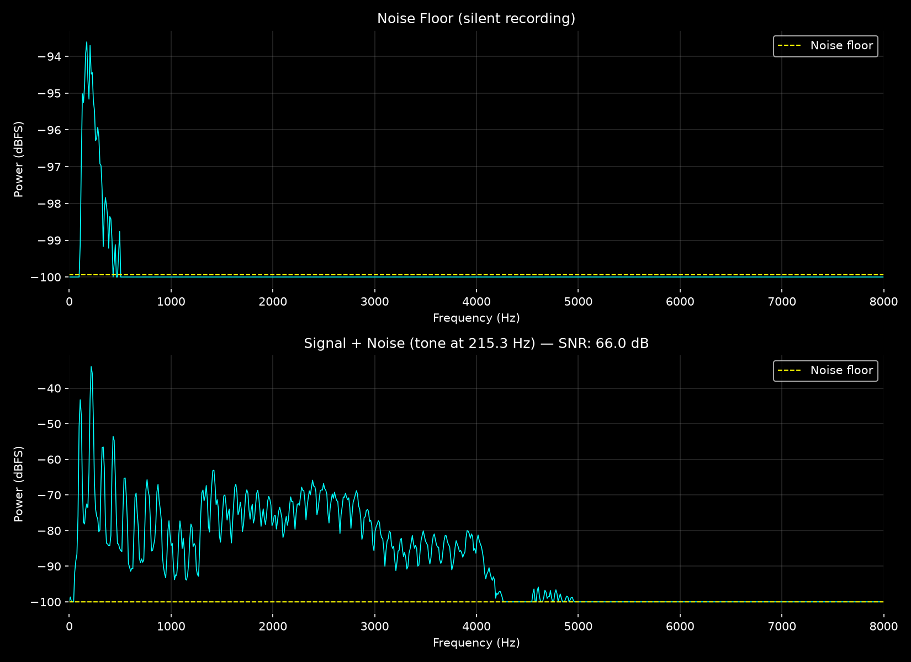

# Real-Time Audio Spectrum Analyzer & Equalizer

A real-time signal chain analysis tool built in Python that captures live microphone input, applies a 3-band Butterworth equalizer, and visualizes the frequency spectrum. Designed as a software-first DSP project to explore filter design and signal characterization concepts before implementing them on hardware.

   

---

## Project Structure

| File | Description |
|---|---|
| `spectrum_analyzer.py` | Live FFT spectrum analyzer with interactive 3-band equalizer sliders |
| `spectrum_with_filter.py` | Spectrum analyzer with Butterworth filter applied to the signal chain |
| `filter_design.py` | Designs and plots theoretical Bode plots for each filter band |
| `filter_validation.py` | Validates filter implementations against theoretical frequency response |
| `noise_analysis.py` | Measures noise floor and SNR of the microphone signal chain |

---

## Filter Validation

Experimentally validated each 4th-order Butterworth filter's frequency response by sweeping sine waves across the audio spectrum and comparing measured attenuation against theoretical Bode plots. Measured and theoretical responses match closely across the full frequency range.


---

## Noise Floor & SNR Analysis

Measured the noise floor of the laptop microphone and calculated SNR for a live audio tone. The signal section clearly shows the fundamental frequency and harmonic content above the noise floor. Measured SNR of 66 dB — consistent with consumer-grade audio equipment specifications.



---

## DSP Concepts Demonstrated

- **Fast Fourier Transform (FFT)** — converts time-domain audio samples into the frequency domain, revealing how much energy exists at each frequency
- **Hanning Window** — applied to each audio chunk before the FFT to reduce spectral leakage caused by sharp edges of finite-length signals
- **Nyquist Theorem** — sample rate of 44100 Hz accurately represents frequencies up to 22050 Hz, covering the full range of human hearing
- **Butterworth Filter Design** — 4th-order maximally flat filters with -80 dB/decade rolloff, implemented using second-order sections (SOS) for numerical stability
- **SNR & Noise Floor Measurement** — power spectral density computed via averaged FFT chunks; SNR calculated as ratio of peak signal power to median noise floor power
- **Harmonic Distortion** — noise analysis plots reveal harmonic content of voice signals, directly relating to THD measurement in analog circuits
- **Threading Architecture** — audio callback writes only to a shared buffer; all plot updates happen on the main thread, preventing concurrency conflicts

---

## How It Works

```
Mic input
    ↓
┌─────────────────────────┐
│  Bass filter (0-300Hz)  │ × slider gain
├─────────────────────────┤
│  Mid filter (300-3kHz)  │ × slider gain
├─────────────────────────┤
│  Treble filter (3k-20k) │ × slider gain
└─────────────────────────┘
    ↓
Mixed output → Hanning window → FFT → live plot
```

Audio is captured in chunks of 1024 samples at 44100 Hz. Each chunk is passed through three Butterworth filters, mixed according to the slider gains, windowed, and FFT'd to produce a live frequency spectrum updating at ~30 fps.

---

## Requirements

- Python 3.12+
- numpy
- scipy
- matplotlib
- sounddevice
- PyQt5

Install all dependencies with:

```bash
pip install numpy scipy matplotlib sounddevice PyQt5
```

---

## Usage

**Live equalizer:**
```bash
python spectrum_analyzer.py
```
Adjust the Bass, Mid, and Treble sliders in real time. Close the window to stop.

**Filter Bode plots:**
```bash
python filter_design.py
```

**Filter validation:**
```bash
python filter_validation.py
```

**Noise floor & SNR analysis:**
```bash
python noise_analysis.py
```
Stay silent for the first recording, then hum or whistle a steady tone for the second.

---

## Hardware Roadmap

This project is designed as the software foundation for a hardware implementation. Planned next steps when lab access opens in August:

- Build the bass, mid, and treble filters as Sallen-Key op-amp circuits on a breadboard
- Use this analyzer to measure the actual hardware filter frequency response
- Compare measured hardware response against LTSpice simulation and theoretical Bode plots
- Document the full software → simulation → hardware validation pipeline

---

## What's Next (Software)

- Port FIR filter design to Verilog and simulate in ModelSim
- Add THD (Total Harmonic Distortion) measurement to the noise analysis tool
- Add audio output to hear the equalization effect in real time

---

## Author

**Nathan Ten** — 3rd Year Electrical and Computer Engineering student at UC San Diego, specializing in Circuits and Systems.

[GitHub](https://github.com/nathantenn)
